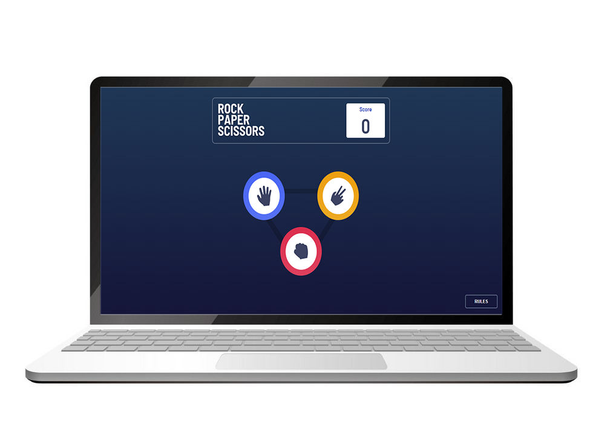
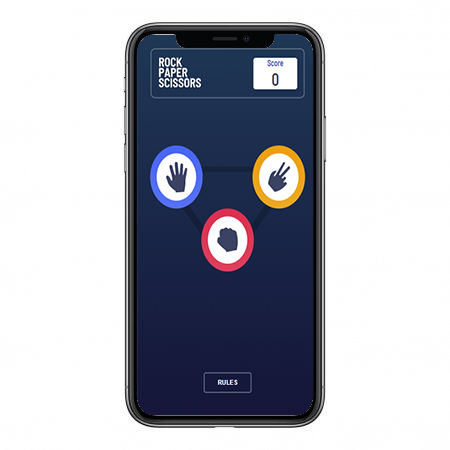

# Rock, Paper, Scissors game

<p align="center">


</p>


## Welcome! 👋

This is a Rock, Paper, Scissors game, feel free to send a pull request or give a feedback 😄.

## Techs 💻

- HTML5.
- CSS3 (Flexbox, mobile-fisrt, CSS BEM).
- Javascript.

## The Challenge 🥇

The users should be able to:

- View the optimal layout for the game depending on their device's screen size
- Play Rock, Paper, Scissors against the computer
- Maintain the state of the score after refreshing the browser _(optional)_
- **Bonus**: Play Rock, Paper, Scissors, Lizard, Spock against the computer _(optional)_

### Rules 📖

If the player wins, they gain 1 point. If the computer wins, the player loses one point.

#### Original 💯

- Paper beats Rock
- Rock beats Scissors
- Scissors beats Paper

#### Bonus :heavy_plus_sign:

- Scissors beats Paper
- Paper beats Rock
- Rock beats Lizard
- Lizard beats Spock
- Spock beats Scissors
- Scissors beats Lizard
- Paper beats Spock
- Rock beats Scissors
- Lizard beats Paper
- Spock beats Rock

**Note:** this bonus is not finished yet ⚠️.

## Where to find everything 🔎

Your task is to build out the project to the designs inside the `/design` folder. You can either choose the `original` designs for the simpler version or the `bonus` designs for the harder version. You will find both mobile and desktop versions of the design to work to. Each file is also named depending on which step in the game the design is for.

The designs are in JPG static format. This will mean that you'll need to use your best judgment for styles such as `font-size`, `padding` and `margin`. This should help train your eye to perceive differences in spacings and sizes.

You will find all the required assets in the `public/assets/images` folder. The assets are already optimized.

There is also a `style-guide.md` file, which contains the information you'll need, such as color palette and fonts.

## Running project 🛠️

to run this project on your environment follow these steps:

1. Clone this repository to your local machine running this command 👇

```
git clone https://github.com/washington299/rock-paper-scissors-game.git
```

2. Then go to project's folder running this command 👇

Windows:
```
cd .\rock-paper-scissors-game\
```
Linux:
```
cd ./rock-paper-scissors-game
```

3. Now you can open the project on your editor and drag the **index.html** file to the browser 😄.

---

Made with ❤️ by [Washington Campos](https://github.com/washington299).

